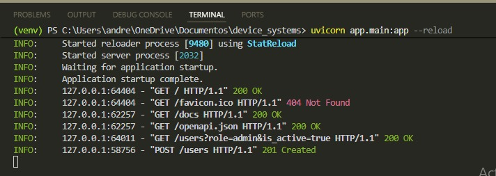
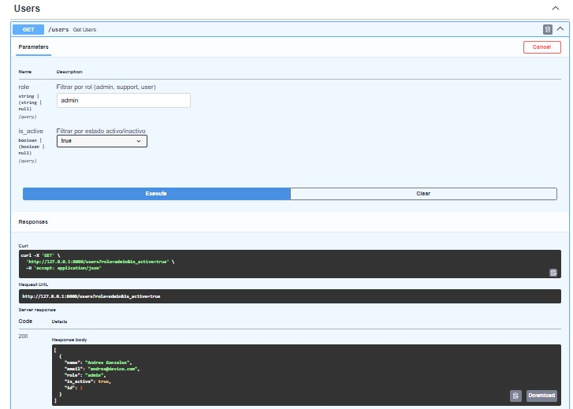
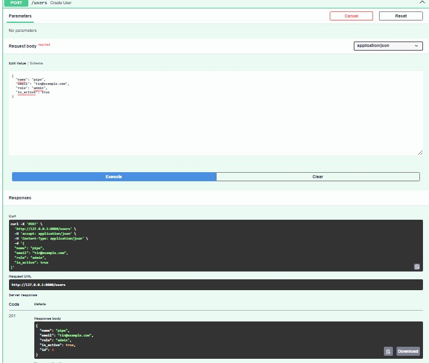
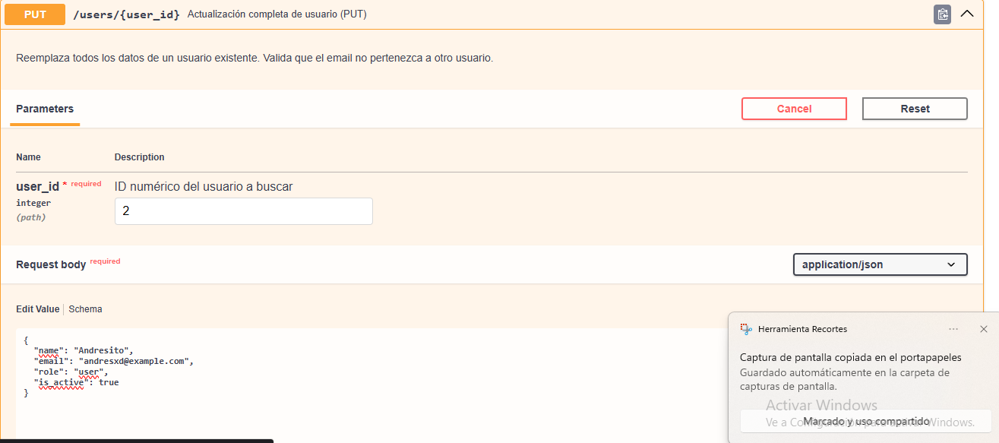
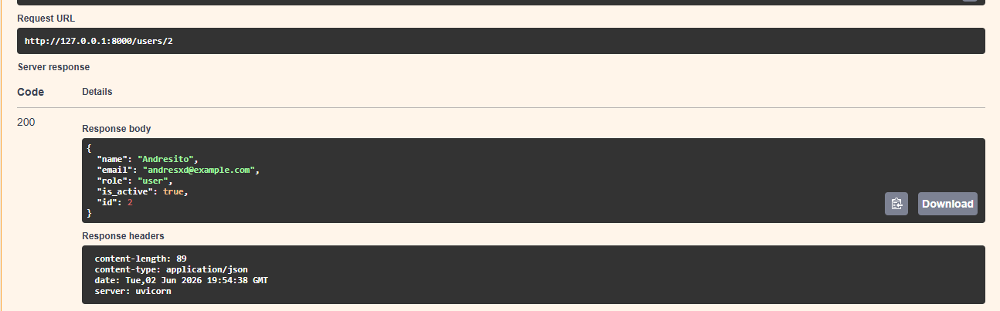
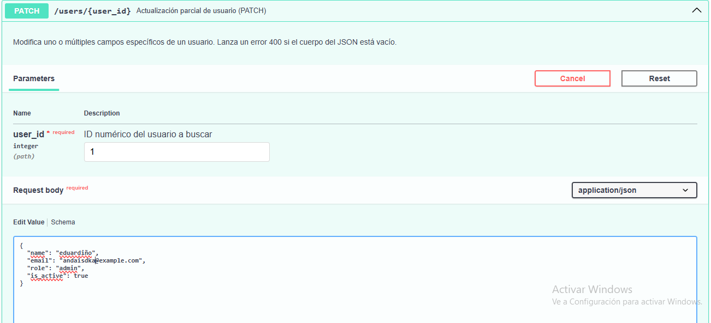
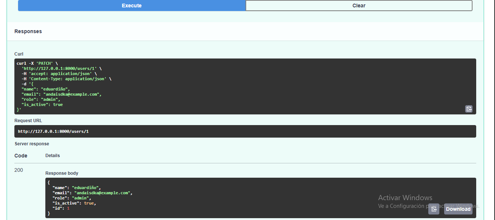
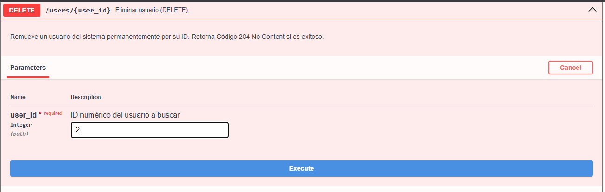
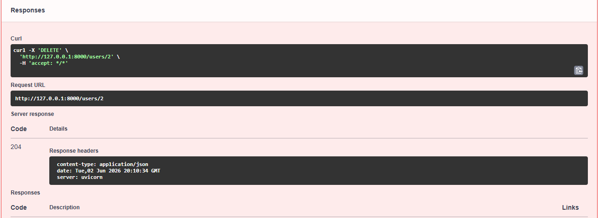

# Nombre proyecto: Device_systems

## Descripcion Api:
device_systems es una solución API REST de nivel profesional desarrollada con el framework FastAPI. El propósito central de esta aplicación es la administración avanzada y control del recurso Users (Usuarios del Sistema), sirviendo como la base de gestión de identidad para una plataforma global de control de dispositivos.

## Tecnologias Utilizadas
* **Python 3.10+** - Lenguaje de programación base.
* **FastAPI** - Framework web asíncrono de alto rendimiento para la construcción de la API.
* **Pydantic v2** - Gestión de esquemas, tipado estricto y validación de datos en tiempo de ejecución.
* **Uvicorn** - Servidor web nativo ASGI para la ejecución local de la aplicación. 

## Instalación de Dependencias

1. Asegúrese de estar en la raíz del proyecto device_systems/
2. Cree y active su entorno virtual de Python:
powershell
   # En Windows (PowerShell):
   python -m venv venv
   .\venv\Scripts\Activate.ps1

# Servidor corriendo en el entorno virtual

# Capturas Swagger UI

## Get Users

## Get users-id

## Post users

## Put users

## Patch users

## Delete users

## Explicacion Depends
El mecanismo de Inyección de Dependencias de FastAPI a través de la función Depends() actúa como un interceptor en el ciclo de vida de una petición HTTP. Su función primordial en device_systems es centralizar y reutilizar lógica común de validación antes de que la solicitud toque la capa de negocio (services).

## Explicacion errores implementados
La API implementa una gestión estructural de excepciones utilizando la clase nativa HTTPException de FastAPI. Esto garantiza que ante cualquier fallo previsto en las reglas de negocio, el servidor no sufra una caída inesperada (crash), sino que responda de manera elegante al cliente con un código de estado HTTP semántico y un cuerpo en formato JSON legible ({"detail": "Mensaje de error"}).

Se controlaron específicamente los siguientes escenarios de error requeridos por la guía:

Usuario no encontrado (404 Not Found): Gestionado desde la dependencia central. Si se intenta consultar, editar o borrar un ID que no existe en users_db.py, la API aborta el proceso y responde con un código 404, protegiendo la integridad de las operaciones.

Correo electrónico duplicado (400 Bad Request): Antes de completar el flujo de un POST o un PUT, el sistema invoca el servicio de búsqueda por email. Si el correo ya pertenece a otro usuario registrado, se levanta una excepción 400 impidiendo el registro de datos duplicados.

Intento de actualización sin datos (400 Bad Request): En el endpoint PATCH, la ruta extrae los campos modificados usando .model_dump(exclude_unset=True). Si el cliente envía un cuerpo vacío ({}), el sistema lo detecta y responde con un código 400 indicando que debe proveer al menos un campo para actualizar.

Rol no permitido (422 Unprocessable Entity): Para mitigar este error en la capa de entrada, el archivo user_schema.py define el tipo de dato utilizando la directiva Literal["admin", "user", "support"] de Pydantic. Si un cliente intenta enviar un rol inválido (por ejemplo: "role": "guest"), Pydantic intercepta la petición automáticamente y la rebota con un código 422 detallando qué campo falló, sin permitir que el dato erróneo contamine las capas internas de la aplicación. 

### Reflexion personal FastApi 
El desarrollo del proyecto device_systems demostró que FastAPI optimiza drásticamente los tiempos de desarrollo al unificar el tipado estático de Python con el protocolo HTTP. Gracias a su integración nativa con Pydantic v2, el framework gestiona de forma automática la validación estricta de datos (como correos y roles) y el control de respuestas mediante Response Models, reduciendo las líneas de código manual. Además, herramientas automatizadas como Swagger UI facilitan las pruebas en tiempo real de la lógica de negocio —como el control de duplicados (400) o filtrados— e inyectar cabeceras personalizadas de manera limpia, logrando una API robusta, estandarizada y altamente escalable con el mínimo esfuerzo.

### video explicacion
https://youtu.be/vcZ8BrKF4QQ

### video explicacion 2
