## Captura de ejecución de alembic init

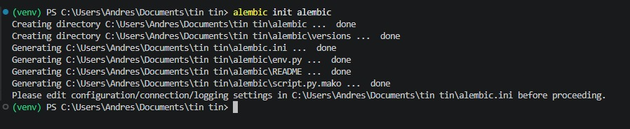

## Captura de creación de migración con alembic revision --autogenerate

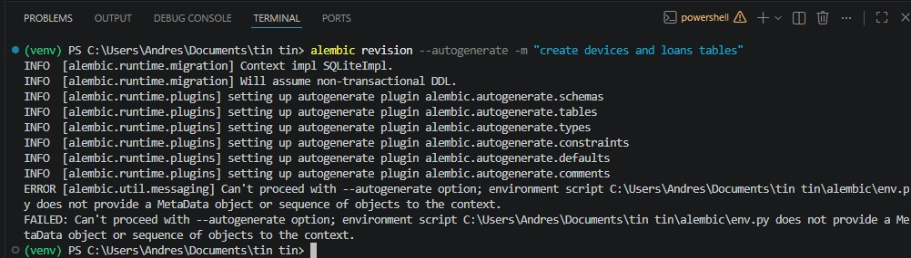

## Captura de aplicación de migración con alembic upgrade head

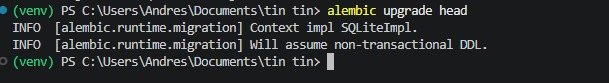

## Captura de estructura de tablas generadas

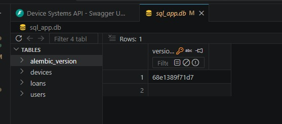

## Capturas de Swagger UI

### Creacion Usuario

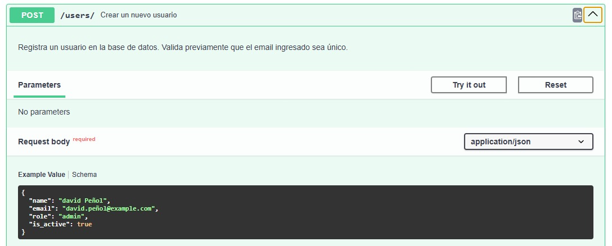

### Creacion Devices

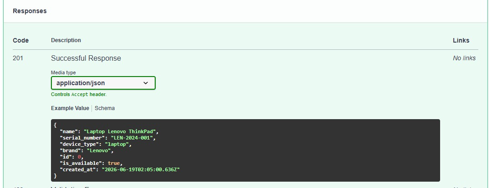

### Creacion Prestamo

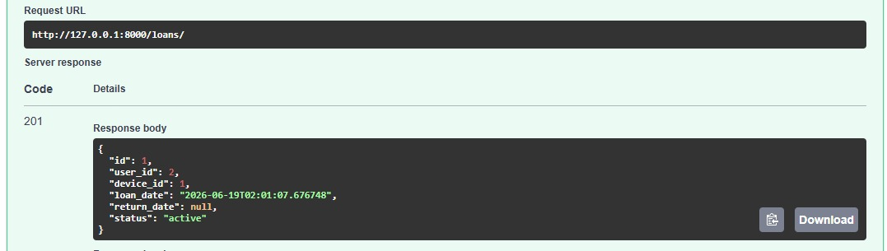

## Evidencia de creación de usuario, dispositivo y préstamo

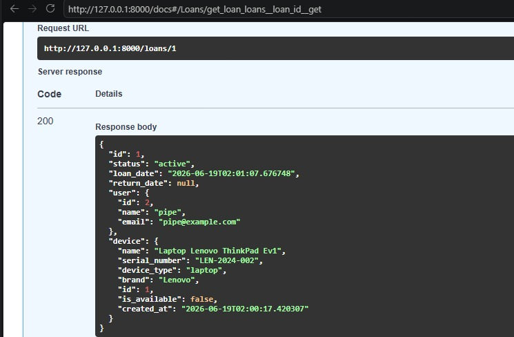

## Evidencia de consultas con joins

## Evidencia de filtros aplicados

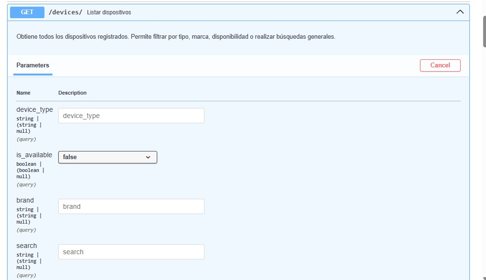

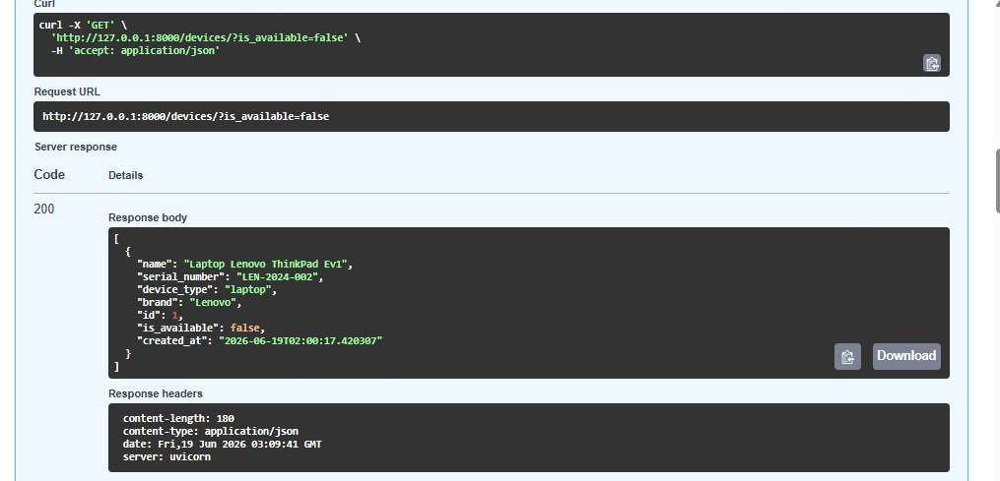

## Evidencia de devolución de dispositivo

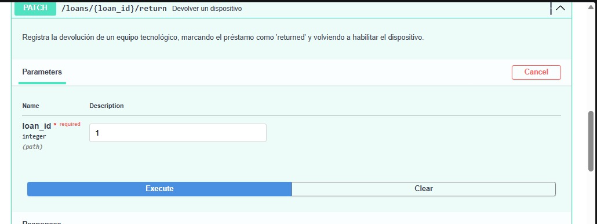

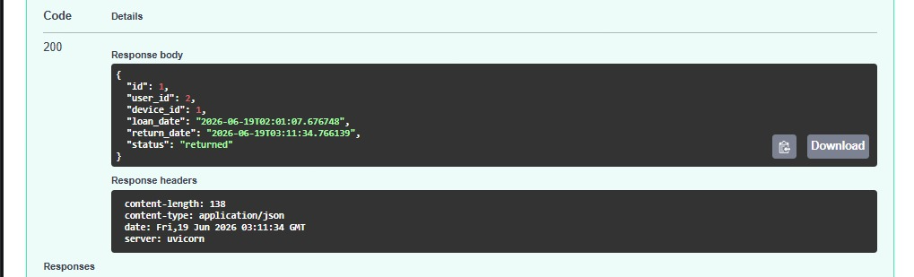

## Reflexión sobre la importancia de migraciones, relaciones y consultas avanzadas

+ me parecio bastante complicado al inicio al aplicarlo pero no fue tan exageradamente dificil como parece simplemente toma tiempo, pero a fin de cuentas fue divertido, en cuanto a la importancia podemos decir que ahora es mas parecido a una aplicacion mas segura por asi decirlo ya que evitamos riesgos de perdidas de datos y damos por asi decirlo como un control mas realista a los datos de nuestra aplicacion, tambien que ahora es mas "portable" porque todo esto se puede pasar ya que la base de datos se reconstruye tal cual.

## Link Video Socializacion

