## Captura de la estructura del proyecto 
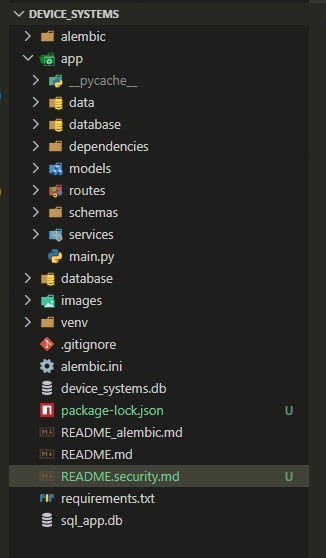

## Captura de migración Alembic aplicada

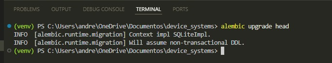

## Captura del registro de usuario

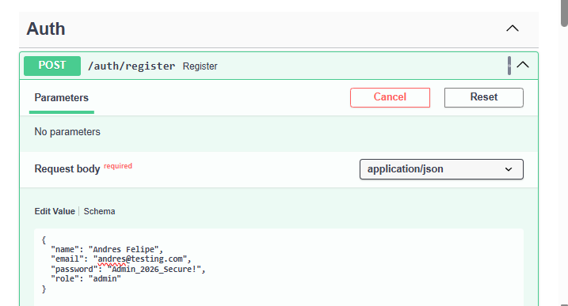

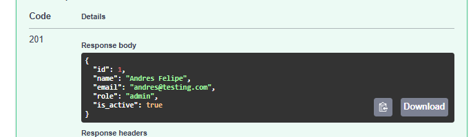

## Captura del login y token generado

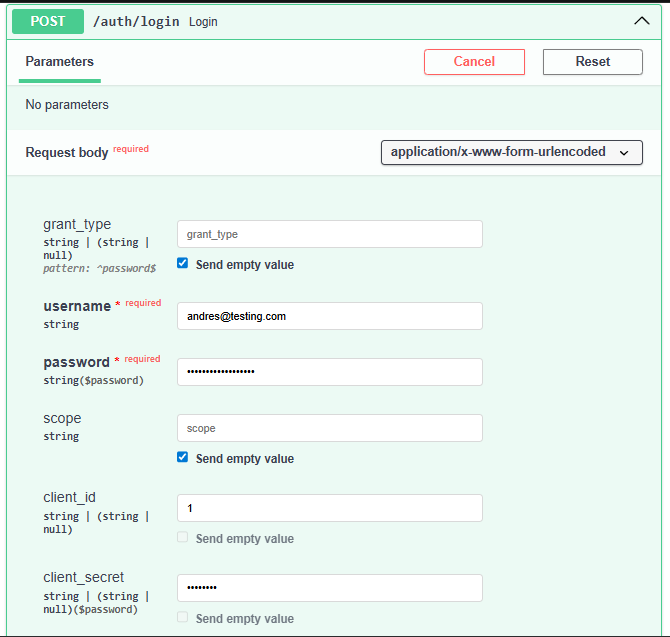

## Captura de /auth/me

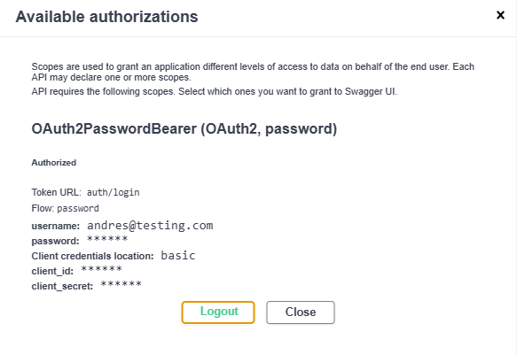

## Captura de acceso sin token

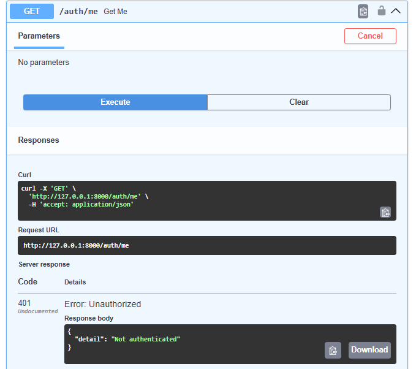

## Captura de acceso con rol no permitido

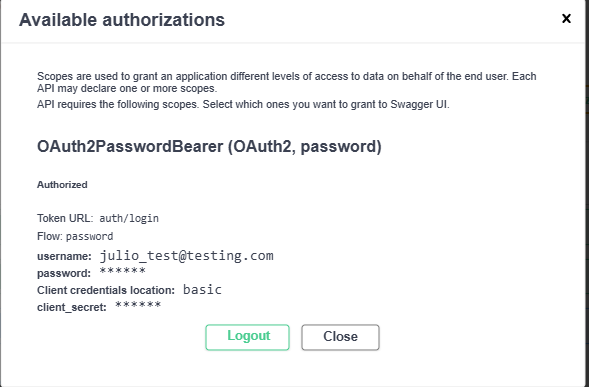

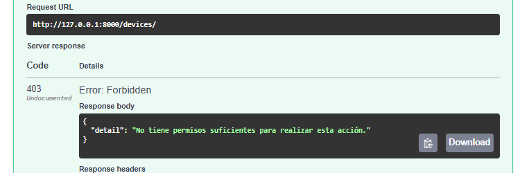

## Captura de Swagger/OpenAPI con OAuth2

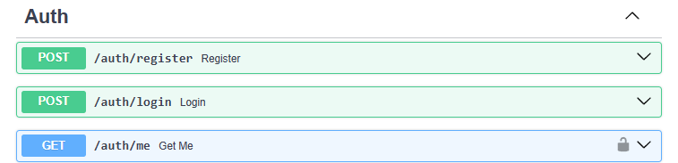

## Captura de cabeceras del middleware

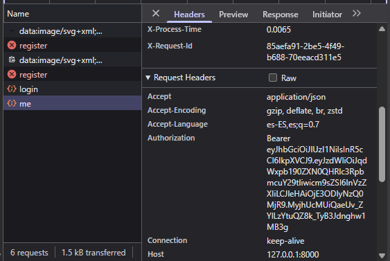

## Captura de prueba de rate limiting

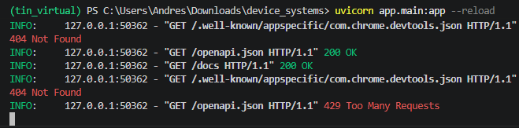

## Explicación de CORS configurado

CORS (Cross-Origin Resource Sharing) o Intercambio de Recursos de Origen Cruzado es un mecanismo de seguridad que implementan los navegadores web para evitar que un sitio web malicioso cargue recursos de tu API sin autorización

## Reflexión final sobre la importancia de la seguridad en APIs REST

La seguridad en una API REST no es una característica opcional, sino el pilar fundamental que transforma un desarrollo funcional en una arquitectura robusta y con calidad de producción. La correcta implementación de capas como la autenticación y autorización por roles (JWT) para evitar la escalada de privilegios, el control de flujo (Rate Limiting) para mitigar ataques de denegación de servicio (DoS), y la restricción perimetral (CORS) para bloquear orígenes no confiables, no solo resguarda la integridad y disponibilidad de los activos digitales de la organización, sino que además mitiga vulnerabilidades críticas y construye un entorno de software confiable, escalable y preparado para las exigencias del mercado real

## Video final explicativo
https://youtu.be/zHD0c7P1MhA